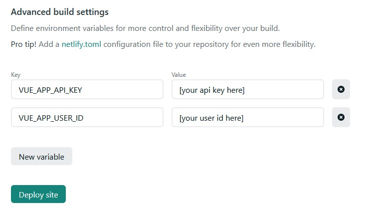

# artfolio

ArtFolio is a vuejs website using Flickr API to fetch content from a user in particular  
You need your API key ([Get it here](https://www.flickr.com/services/apps/create/apply/)) and your user id (you can found it on your profile's URL)  
If you made a custom adress, just copy/paste this on your navigator with your API key and your username and get the nsid :

``` txt
"https://api.flickr.com/services/rest/?method=flickr.people.findByUsername&api_key=[apiKey]&user_id=[username]&format=json&nojsoncallback=1"
```

Note : if you chose anything else than "everyone" in your [privacy settings](https://www.flickr.com/account/prefs/downloads/?from=privacy), the shown photos won't be in the original quality, but something like half of the original quality

## Project setup

```shell
npm install
```

Create a `.env.local` file and put the api key in

```env
VUE_APP_API_KEY=[key]
VUE_APP_USER_ID=[userId]
```

### How to deploy

#### Easy way

All you need is a github account, a netlify account

1. Just fork that repo, then if you want to change the color of the theme, it's [here](src/plugins/vuetify.js) (src/plugins/vuetify.js) (you can modify it directly with github)
2. Netlify can use your github account to build and deploy the project, all you have to do is to link your github account and choose the repositery you want to deploy.
3. When asked about build setting, put your flickr's api info like this



### Compiles and hot-reloads for development

```shell
npm run serve
```

### Compiles and minifies for production

```shell
npm run build
```

### Lints and fixes files

```shell
npm run lint
```

### Customize configuration

See [Configuration Reference](https://cli.vuejs.org/config/).
